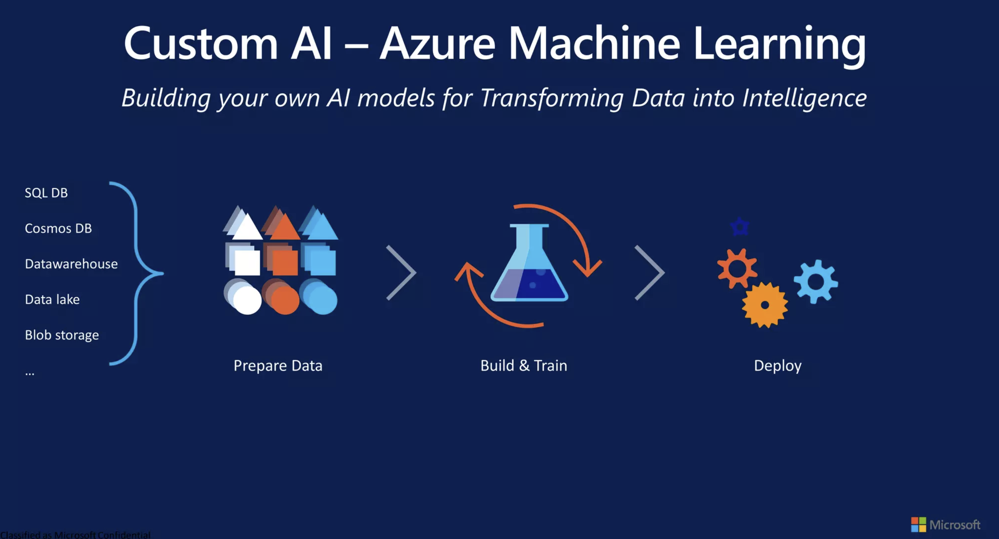
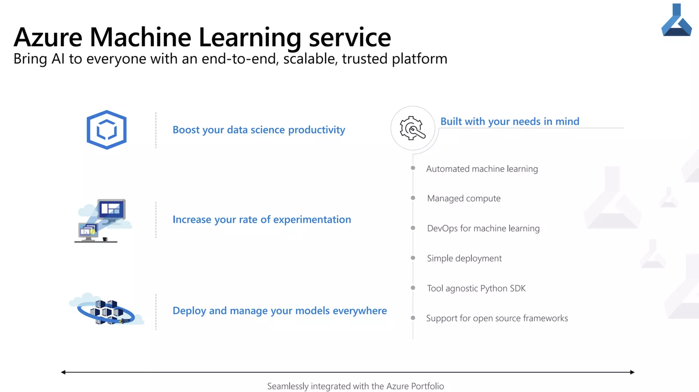

# Azure Machine Learning

Costa Rica

 
 [Cloud2BR OSS - Learning Hub](https://github.com/Cloud2BR-MSFTLearningHub)

Last updated: 2026-01-29

----------

Key Features: 
- Accelerates time to value.
- Provides a unified experience for data engineering, data science, and business analysis.
- Enables data warehousing and data virtualization scenarios.
- Extends T-SQL to address streaming and machine learning scenarios. 
- Integrates AI with SQL by using machine learning models to score data.
- Allows data engineers to use a code-free visual environment for managing data pipelines.
- Automates query optimization.
- Seamlessly integrates with Power BI, CosmosDB, and AzureML.
- Develop with confidence.
- Design responsibly.
- Take advantage of key features for the full ML lifecycle. 

Creating a new Azure Machine Learning Platform account: 
- You can create and manage Azure resources for Azure Machine Learning Platform via the Azure portal. 

<!-- START BADGE -->

  
  
Refresh Date: 2026-04-07

<!-- END BADGE -->