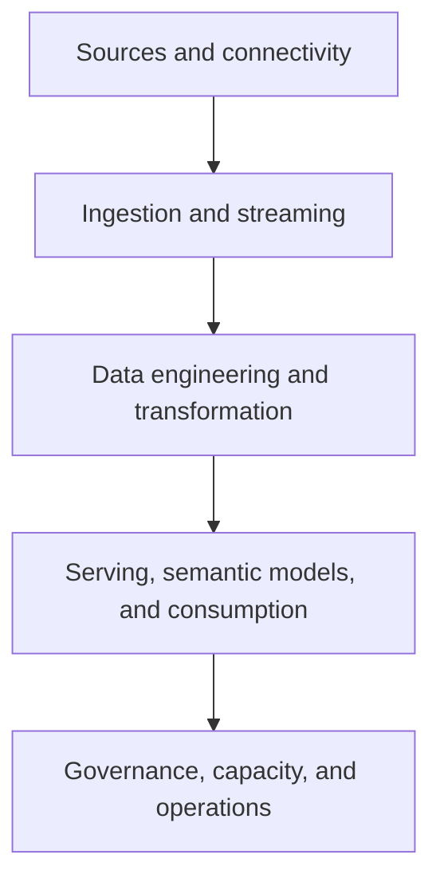

# Analytics and Fabric

The Azure Analytics section is the repository's largest data-platform learning area. It covers Microsoft Fabric, Synapse Analytics, Event Hubs, Databricks, connections, capacity, governance, data pipelines, and migration scenarios.

## Scenario families

| Family | Included learning topics |
| --- | --- |
| Microsoft Fabric | AI skills, capacity, reservations, licensing, configuration, monitoring, governance, GitHub integration, SQL mirroring, Power BI, pipelines, tenant migration, and external-platform migrations. |
| Synapse Analytics | Spark-version management and cost-breakdown scenarios. |
| Event Hubs | Message routing, Microsoft Defender advanced-hunting integrations, and monitoring performance delays. |
| Databricks | Connection patterns for ADLS, Synapse, Power BI, Cosmos DB, Data Factory, Event Hubs, Azure ML, SQL databases, Fabric, and Medallion architecture demonstrations. |

## Architecture checks

- Define data-product ownership, classification, retention, and lineage before selecting a processing engine.
- Test source connectivity, credential boundaries, private-network requirements, and egress dependencies early.
- Separate development, validation, and production resources; promote definitions intentionally and verify data refresh/reload behavior in each target environment.
- Monitor capacity, throttling, Spark or pipeline execution, cost, freshness, and semantic-model or report outcomes after a demo is promoted.

## Source indexes

- [Microsoft Fabric guides, demos, troubleshooting, and connections](https://github.com/Cloud2BR-MSFTLearningHub/DemosScenarios-TechTalks/tree/main/0_Azure/2_AzureAnalytics/0_Fabric)
- [Azure Synapse Analytics scenarios](https://github.com/Cloud2BR-MSFTLearningHub/DemosScenarios-TechTalks/tree/main/0_Azure/2_AzureAnalytics/1_SynapseAnalytics)
- [Azure Event Hubs scenarios](https://github.com/Cloud2BR-MSFTLearningHub/DemosScenarios-TechTalks/tree/main/0_Azure/2_AzureAnalytics/2_EventHubs)
- [Azure Databricks guides, connections, and demos](https://github.com/Cloud2BR-MSFTLearningHub/DemosScenarios-TechTalks/tree/main/0_Azure/2_AzureAnalytics/3_Databricks)

!!! warning
    Capacity, SKU, reservation, license, and region examples are point-in-time learning material. Verify current availability, pricing, and tenant prerequisites before using them for a purchasing or production decision.