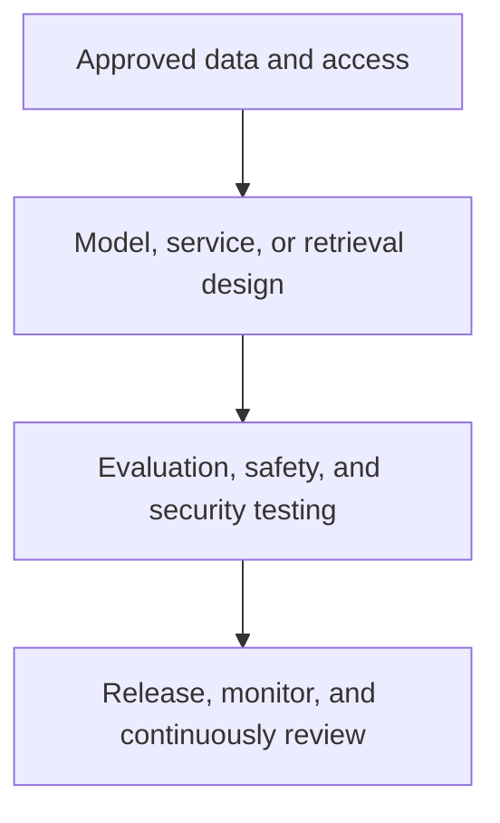

# Azure AI and machine learning

This collection spans Azure AI Foundry, Azure OpenAI, Azure AI Search, RAG, content safety, bots, vision, document intelligence, language, speech, translation, video, recommendation services, and Azure Machine Learning. Use it to explore a scenario, then establish the responsible-AI, security, data, and operational controls required for the intended workload.

## Scenario families

| Family | Included learning topics |
| --- | --- |
| Azure AI Foundry | Copilot and app scenarios, hubs/projects, control plane, API keys, content filtering, evaluations, SDLC, model deployment, data zones, load balancing, and pricing estimation. |
| Azure OpenAI | Deployments, quota, provisioned throughput, token and cost analysis, model availability/retirement, assistants, parameter variants, private-bot patterns, and zero-data-retention context. |
| Retrieval and search | RAG overview, zero-trust RAG, indexing, document and SharePoint-related knowledge scenarios. |
| AI services | Safety, bots, vision, document intelligence, face, immersive reader, speech, translator, language, video indexer, and recommendation services. |
| Machine learning | Model deployment considerations and OCR/document-processing examples. |

## Essential controls

- Use only approved data sources; classify and minimize sensitive input, retrieval content, prompts, and telemetry.
- Review identity, model/service access, network exposure, key management, content-safety configuration, and audit requirements.
- Define quality, grounding, safety, latency, cost, and failure-mode evaluations before release.
- Plan for model retirement, regional availability, quota behavior, and safe fallback paths.

## Source indexes

- [Azure AI service overview and individual service guides](https://github.com/Cloud2BR-MSFTLearningHub/DemosScenarios-TechTalks/tree/main/0_Azure/3_AzureAI)
- [Azure AI Search and RAG scenarios](https://github.com/Cloud2BR-MSFTLearningHub/DemosScenarios-TechTalks/tree/main/0_Azure/3_AzureAI/0_AISearch)
- [Azure OpenAI scenarios](https://github.com/Cloud2BR-MSFTLearningHub/DemosScenarios-TechTalks/tree/main/0_Azure/3_AzureAI/9_AzureOpenAI)
- [Azure AI Foundry scenarios](https://github.com/Cloud2BR-MSFTLearningHub/DemosScenarios-TechTalks/tree/main/0_Azure/3_AzureAI/AIFoundry)
- [Azure Machine Learning scenarios](https://github.com/Cloud2BR-MSFTLearningHub/DemosScenarios-TechTalks/tree/main/0_Azure/3_AzureAI/AMachineLearning)

!!! danger
    Do not infer that a demo architecture is approved for regulated, sensitive, or production data. Evaluate the exact model, feature, region, retention, safety, and compliance properties that apply at implementation time.