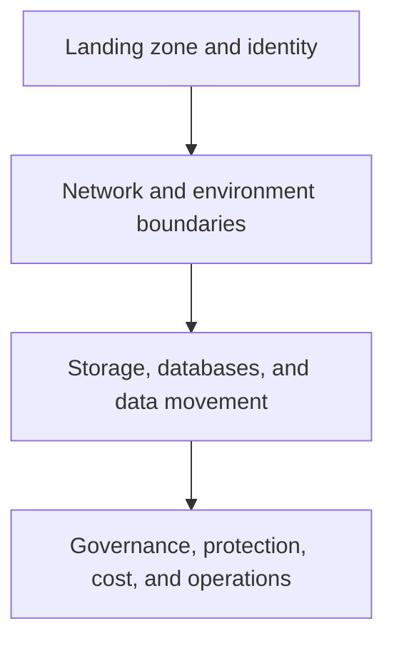

# Azure foundations and data

Azure scenarios need a foundation that handles environment boundaries, identity, networking, governance, data lifecycle, and cost before workload-specific services are assembled. The original guides cover Azure fundamentals, storage, databases, migration paths, and data management demonstrations.

## Learning areas

| Area | Scenarios and questions |
| --- | --- |
| Azure fundamentals | Learn the IaaS, PaaS, and SaaS context; choose regions, compute, environments, and delivery boundaries. |
| Storage and data movement | Explore Blob Storage, SharePoint-to-Azure storage movement, and data-lake-oriented patterns. |
| Databases | Review Cosmos DB, SQL Database, Azure Arc SQL Server, SQL tooling, migrations, MySQL backup/recovery, and database operations. |
| Data protection | Examine Purview, Priva, security groups, custom roles, and Azure Arc context. |
| Cost management | Use billing report and budget-alert scenarios as a learning baseline for resource accountability. |

## Source guides

- [Azure overview and fundamentals](https://github.com/Cloud2BR-MSFTLearningHub/DemosScenarios-TechTalks/tree/main/0_Azure/0_AzureFundamentals)
- [Azure Data overview](https://github.com/Cloud2BR-MSFTLearningHub/DemosScenarios-TechTalks/tree/main/0_Azure/1_AzureData)
- [Data storage scenarios](https://github.com/Cloud2BR-MSFTLearningHub/DemosScenarios-TechTalks/tree/main/0_Azure/1_AzureData/0_DataStorage)
- [Database scenarios and migrations](https://github.com/Cloud2BR-MSFTLearningHub/DemosScenarios-TechTalks/tree/main/0_Azure/1_AzureData/1_Databases)
- [Data protection and management](https://github.com/Cloud2BR-MSFTLearningHub/DemosScenarios-TechTalks/tree/main/0_Azure/5_DataProtectionMng)
- [Azure cost management](https://github.com/Cloud2BR-MSFTLearningHub/DemosScenarios-TechTalks/tree/main/0_Azure/6_AzureCostManagement)

!!! tip
    A demo can prove a service interaction, but it does not establish a landing-zone design. For each scenario, decide who owns the subscription, identity path, network route, data classification, logging, backup, budget, and production support model.