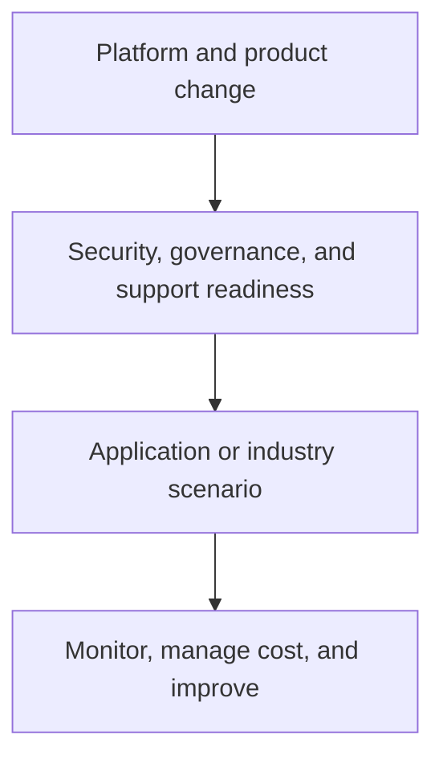

# Azure operations, protection, and apps

The remaining Azure material connects platform delivery with daily operations: Azure DevOps, Purview and Priva, cost and support, application/compute/IoT/Logic Apps scenarios, industry examples, certifications, and technology updates.

## Learning areas

| Area | Scenarios and guides |
| --- | --- |
| DevOps | Azure DevOps overview, agent considerations, and billing/server comparisons. |
| Governance and protection | Purview DLP, glossary, cost, enterprise/free context, Priva, security groups, custom roles, and Azure Arc. |
| Applications and integration | App Service certificates, multi-container app to AKS, Azure Container Apps, Red Hat OpenShift, Defender, IoT, and Logic Apps scenarios. |
| Cost and support | Billing reports, budget alerts, and Azure support material. |
| Industry and learning | Healthcare, retail, certification learning paths, and Azure product-news updates. |

## Operational questions to answer

1. Who owns the workload, deployment pipeline, incident response, and support escalation?
2. Are logs, metrics, alerts, diagnostic retention, and cost budgets configured before a scenario becomes shared?
3. Does the data classification, role model, DLP posture, and compliance requirement match the workload's real use?
4. Can dependencies such as certificates, external brokers, connectors, Kubernetes, or private networking be operated reliably?

## Source indexes

- [Azure DevOps](https://github.com/Cloud2BR-MSFTLearningHub/DemosScenarios-TechTalks/tree/main/0_Azure/4_AzureDevOps)
- [Data protection and management](https://github.com/Cloud2BR-MSFTLearningHub/DemosScenarios-TechTalks/tree/main/0_Azure/5_DataProtectionMng)
- [Cost management](https://github.com/Cloud2BR-MSFTLearningHub/DemosScenarios-TechTalks/tree/main/0_Azure/6_AzureCostManagement)
- [Azure applications, compute, IoT, and Logic Apps](https://github.com/Cloud2BR-MSFTLearningHub/DemosScenarios-TechTalks/tree/main/0_Azure/8_AzureApps)
- [Industry-specific scenarios](https://github.com/Cloud2BR-MSFTLearningHub/DemosScenarios-TechTalks/tree/main/0_Azure/_industry-specific)
- [Azure technology updates](https://github.com/Cloud2BR-MSFTLearningHub/DemosScenarios-TechTalks/tree/main/0_Azure/WhatsNew)