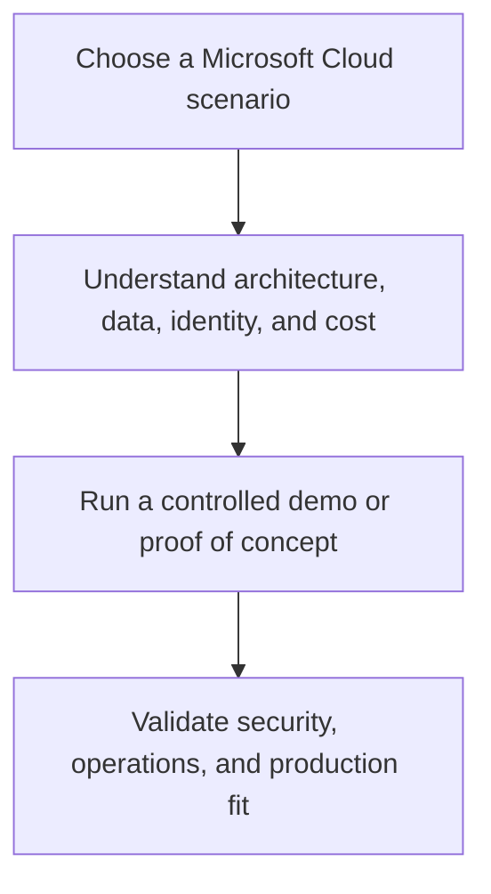

# Microsoft Cloud Demos, Scenarios, and Tech Talks

This learning hub organizes the repository's Microsoft Cloud demonstrations, scenario notes, and tech-talk material. It provides a complete, navigable path through Azure, Microsoft 365, Dynamics 365, and Power Platform topics, while retaining the original source guides for each detailed walkthrough.

!!! warning
    These demonstrations are learning material based on personal experience. They are not official product guidance or support. Confirm current feature availability, service limits, licensing, security controls, and deployment guidance in the official Microsoft documentation before implementing a scenario.

  <a class="guide-card" href="azure-foundations-and-data/"><strong>Azure foundations and data</strong>Landing zones, storage, databases, migrations, governance, and cost foundations.</a>
  <a class="guide-card" href="analytics-and-fabric/"><strong>Analytics and Fabric</strong>Fabric, Synapse, Event Hubs, Databricks, data movement, and capacity scenarios.</a>
  <a class="guide-card" href="azure-ai-and-machine-learning/"><strong>Azure AI and ML</strong>Azure AI Foundry, OpenAI, RAG, AI Search, safety, machine learning, and AI services.</a>
  <a class="guide-card" href="azure-operations-and-apps/"><strong>Cloud operations and apps</strong>DevOps, data protection, Purview, cost, support, application, IoT, and industry scenarios.</a>
  <a class="guide-card" href="microsoft-365-and-dynamics/"><strong>Microsoft 365 and Dynamics</strong>Productivity and business application landing points.</a>
  <a class="guide-card" href="power-platform-and-copilot/"><strong>Power Platform and Copilot</strong>Power Apps, Power BI, and Copilot Studio scenarios.</a>

## How to use this hub

1. Start with the product area closest to the scenario you are exploring.
2. Use the curated pages to identify the architecture and operational questions that the demo raises.
3. Open the linked original source guide for the complete steps, sample material, and related notes.
4. Rebuild the scenario in an isolated environment, then evaluate its security, governance, cost, and operational fit before broader adoption.

## Complete source coverage

The original repository contains **207 Markdown guides**. The [Source library](source-library.md) accounts for every guide through its source-domain indexes, including 138 detailed Azure Analytics and Azure AI documents.