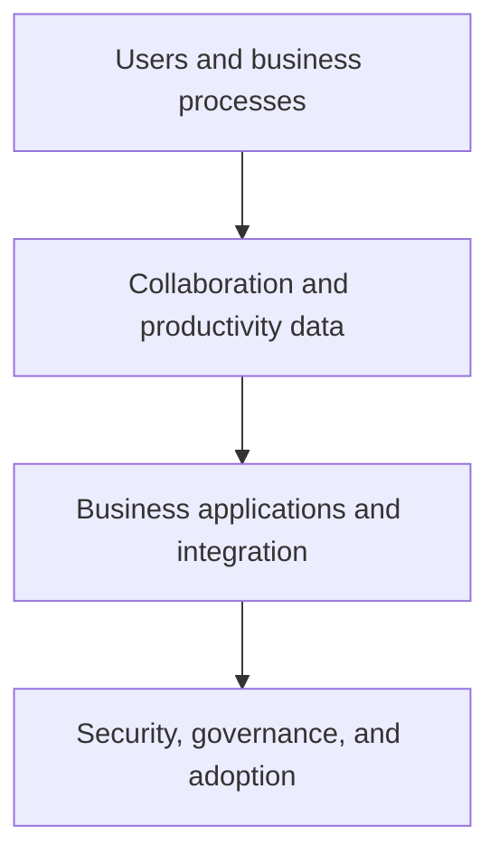

# Microsoft 365 and Dynamics 365

Microsoft 365 and Dynamics 365 scenarios connect productivity, collaboration, business processes, data, security, and automation. These landing pages point to the source material for Excel, Forms, Planner, SharePoint, and Dynamics 365 exploration.

## Focus areas

| Product area | Learning focus |
| --- | --- |
| Microsoft 365 | Productivity and collaboration entry points: Excel, Forms, Planner, and SharePoint. |
| Dynamics 365 | Business applications context for CRM and ERP scenarios. |
| Cross-platform integration | Evaluate identity, data ownership, sharing, retention, compliance, lifecycle, and automation impacts when connecting services. |

## Source guides

- [Microsoft 365 overview](https://github.com/Cloud2BR-MSFTLearningHub/DemosScenarios-TechTalks/tree/main/1_MS365)
- [Excel](https://github.com/Cloud2BR-MSFTLearningHub/DemosScenarios-TechTalks/tree/main/1_MS365/Excel)
- [Microsoft Forms](https://github.com/Cloud2BR-MSFTLearningHub/DemosScenarios-TechTalks/tree/main/1_MS365/Forms)
- [Microsoft Planner](https://github.com/Cloud2BR-MSFTLearningHub/DemosScenarios-TechTalks/tree/main/1_MS365/Planner)
- [SharePoint](https://github.com/Cloud2BR-MSFTLearningHub/DemosScenarios-TechTalks/tree/main/1_MS365/SharePoint)
- [Dynamics 365](https://github.com/Cloud2BR-MSFTLearningHub/DemosScenarios-TechTalks/tree/main/2_Dynamics365)

!!! tip
    For a collaboration or business-app demo, define the owner of the records, data-residency and retention requirements, least-privilege access model, and adoption/support plan before integrating it with a production process.