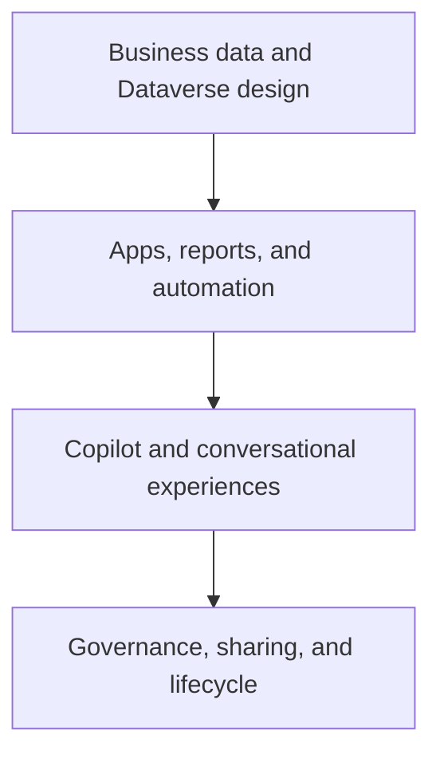

# Power Platform and Copilot Studio

The Power Platform material covers the low-code surface for applications, analytics, automation, and conversational experiences. The guides connect Power Apps, Power BI, and Copilot Studio with broader Microsoft Cloud data and identity patterns.

## Scenario focus

| Area | Questions to explore |
| --- | --- |
| Power Apps | What business process, data model, roles, environments, connectors, and lifecycle are needed for an app? |
| Power BI | How do semantic models, refresh, data access, sharing, licensing, and workspace governance support a report scenario? |
| Copilot Studio | How are custom copilots designed, how is the selected LLM governed, and how can Power BI data be connected safely? |
| Shared platform controls | How will environments, DLP, connector policies, identities, solutions, monitoring, and support be governed? |

## Source guides

- [Power Platform overview](https://github.com/Cloud2BR-MSFTLearningHub/DemosScenarios-TechTalks/tree/main/3_PowerPlatform)
- [Power Apps](https://github.com/Cloud2BR-MSFTLearningHub/DemosScenarios-TechTalks/tree/main/3_PowerPlatform/0_PowerApps)
- [Power BI](https://github.com/Cloud2BR-MSFTLearningHub/DemosScenarios-TechTalks/tree/main/3_PowerPlatform/1_PowerBI)
- [Copilot Studio: design custom copilots](https://github.com/Cloud2BR-MSFTLearningHub/DemosScenarios-TechTalks/blob/main/3_PowerPlatform/2_CopilotStudio/0_Design-Custom-Copilots.md)
- [Copilot Studio: change LLM](https://github.com/Cloud2BR-MSFTLearningHub/DemosScenarios-TechTalks/blob/main/3_PowerPlatform/2_CopilotStudio/1_How-to-Change-LLM-CopilotStudio.md)
- [Copilot Studio: connect Power BI](https://github.com/Cloud2BR-MSFTLearningHub/DemosScenarios-TechTalks/blob/main/3_PowerPlatform/2_CopilotStudio/2_connecting-PowerBI-CopilotStudio.md)

!!! warning
    Low-code does not remove enterprise responsibilities. Test the data-access path, sharing behavior, connector policy, DLP controls, environment strategy, and support ownership before a scenario is adopted by a broader audience.